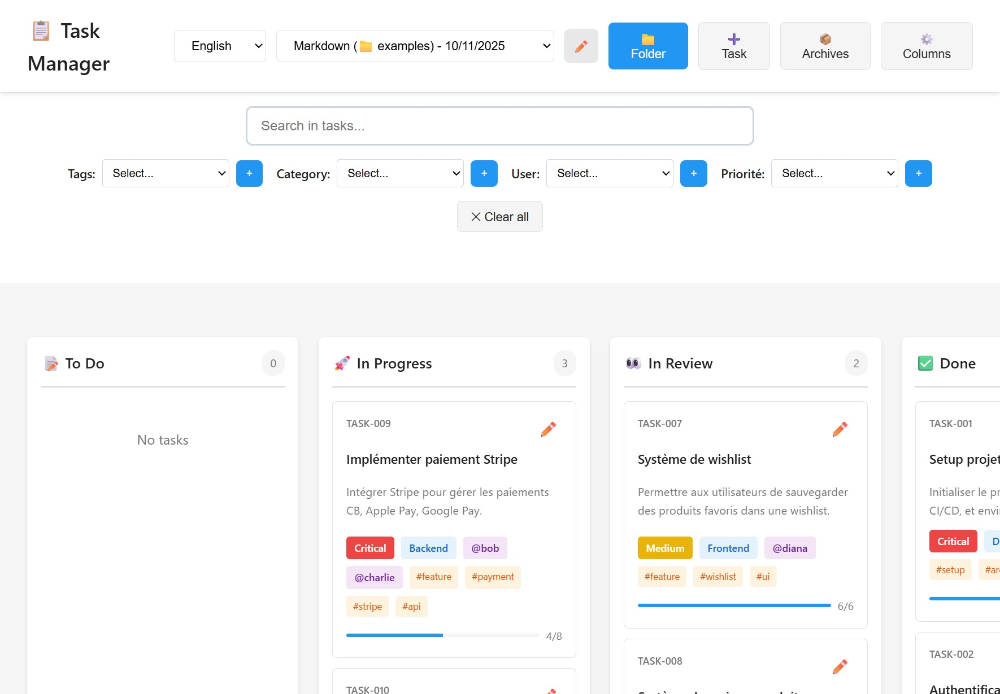
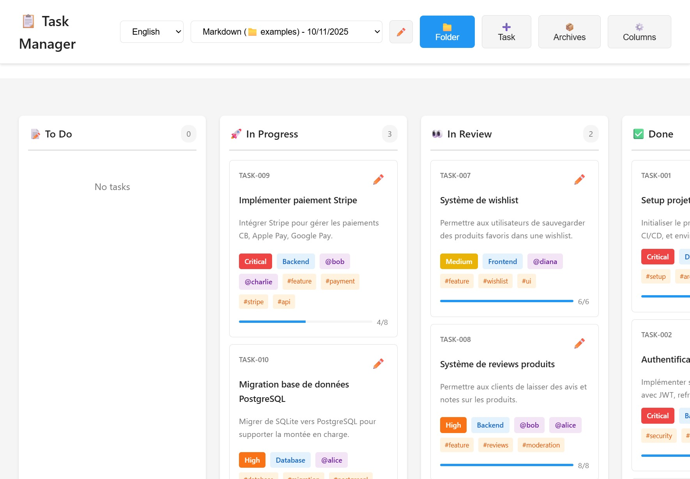

# 📋 Markdown Task Manager

> **[🇫🇷 Version française / French version](./readmeFR.md)**

**Privacy-first Kanban task manager that runs entirely in your browser**

A complete task management system contained in a single HTML file. No cloud, no tracking, no accounts. Your tasks live in plain Markdown files that you control.


*Interactive Kanban board with drag & drop, filters, and rich task management*

---

## 🎯 Why Use This?

**Complete Privacy & Control**
- ✅ **100% local** - Your data never leaves your machine
- ✅ **No tracking** - Zero telemetry, analytics, or accounts
- ✅ **No vendor lock-in** - Plain text files you can edit anywhere
- ✅ **Works offline** - No internet connection required

**Developer-Friendly Workflow**
- ✅ **Git-native** - Version control built in (commit, branch, merge)
- ✅ **Plain Markdown** - Readable and editable in any text editor
- ✅ **Portable** - Single HTML file, copy anywhere
- ✅ **Fast** - Loads in < 100ms, handles 1000+ tasks

**Free Forever**
- ✅ **MIT License** - Use commercially, modify, distribute freely
- ✅ **No subscriptions** - No paywalls, no feature limits
- ✅ **Open Source** - All code readable and auditable


---

## ⚡ Quick Start

### 3 Steps to Get Running

1. **Download** `task-manager.html` from this repository
2. **Open it** in Chrome, Edge, or Opera (double-click)
3. **Select a folder** where you want to store your tasks

That's it! The app creates `kanban.md` and `archive.md` automatically.

### Compatible Browsers

- ✅ Chrome 86+
- ✅ Edge 86+
- ✅ Opera 72+
- ✅ Brave 1.17+
- ❌ Firefox (File System API not available)
- ❌ Safari (File System API not available)

**Why these browsers?** The app uses the File System Access API to read/write your local files directly.

---

## ✨ Core Features

### 1. Interactive Kanban Board



- **Drag & Drop** - Move tasks between columns instantly
- **Customizable columns** - Default: To Do → In Progress → Review → Done
- **Smart counters** - See task counts per column
- **Responsive layout** - Adapts to your screen size

### 2. Rich Task Management


**Complete metadata:**
- Priority levels (Critical, High, Medium, Low)
- Categories (Frontend, Backend, Design, etc.)
- Multi-user assignment (@alice, @bob)
- Multiple tags (#bug, #feature, #urgent)
- Dates (created, start, due, end)
- Full descriptions with Markdown support

**Subtasks:**
- Create nested checklist items
- Visual progress bar (3/5 completed)
- Check/uncheck in real-time
- Auto-save all changes

### 3. Advanced Filtering


**4 filter types (combinable):**
- 🔴 Priority - Critical, High, Medium, Low
- 🔵 Tags - #bug, #urgent, #backend
- 🟣 Categories - Frontend, Backend, Design
- 🟢 Users - @alice, @bob

**Smart autocomplete** - Remembers history, even from archived tasks

### 4. Archive System


- Move completed tasks to `archive.md`
- Search through archives
- Restore tasks to Kanban
- Organize by sections (sprints, months, etc.)

### 5. Multi-Project Support


- Manage up to 10 recent projects
- Quick switcher in header
- Custom project names
- Auto-restore last project

### 6. Global Search

- Search across all tasks and archives
- Real-time filtering as you type
- Find by ID, keywords, or metadata
- Filter results by column

### 7. Live File Sync

- Auto-save every change instantly
- External edits detected (2-second polling)
- Compatible with text editors, IDEs
- Git-friendly workflow

### 8. Multi-Language

- English and French languages
- Seamless language switching
- Complete UI translation
- Markdown files remain in your language

---

## 📦 Installation Guide

### Option 1: Root Installation (Recommended)

Copy 2 files to your project root:

```bash
my-project/
├── kanban.md          # Your active tasks
├── archive.md         # Your completed tasks
├── src/
└── package.json
```

**Minimal kanban.md template:**
```markdown
# Kanban Board

## ⚙️ Configuration

**Columns**: 📝 To Do | 🚀 In Progress | ✅ Done
**Categories**: Frontend, Backend, Design
**Users**: @alice, @bob
**Tags**: #bug, #feature, #docs

## 📝 To Do
## 🚀 In Progress
## ✅ Done

<!-- Config: Last Task ID: 000 -->
```

**Minimal archive.md template:**
```markdown
# Task Archive

> Archived tasks from the project

## ✅ Archives
```

Then:
1. Open `task-manager.html` in your browser
2. Select the `my-project/` folder
3. Start creating tasks!

### Option 2: Subdirectory Installation

Isolate task files in a subfolder:

```bash
my-project/
├── .tasks/            # or docs/tasks/, .kanban/, etc.
│   ├── kanban.md
│   └── archive.md
├── src/
└── package.json
```

Select the `.tasks/` folder when opening the app.

### Option 3: Centralized HTML (Recommended)

Keep one copy of `task-manager.html` for all projects:

```bash
~/tools/
└── task-manager.html  # Single copy

~/projects/
├── project-1/
│   ├── kanban.md
│   └── archive.md
├── project-2/
│   ├── kanban.md
│   └── archive.md
└── project-3/
    ├── kanban.md
    └── archive.md
```

**Advantages:**
- One file to maintain
- Automatic updates for all projects
- Disk space savings

**Quick access alias:**
```bash
# ~/.bashrc or ~/.zshrc
alias tasks='open ~/tools/task-manager.html'  # macOS
alias tasks='xdg-open ~/tools/task-manager.html'  # Linux
alias tasks='start ~/tools/task-manager.html'  # Windows
```

---

## 🚀 Advanced Features

### Auto-Reorganization

**Feature:** Tasks automatically move to the correct column when you edit `**Status**` field in the markdown file.

**Example:**
```markdown
### TASK-042 | My Task
**Status**: in-progress  # Change this in your text editor
```

The app detects the change and moves the task to "🚀 In Progress" column automatically.

**Benefits:**
- Works with external editors (VS Code, Vim, Emacs)
- Saves time on manual dragging
- Consistent with markdown-first workflow

### XSS Protection

All markdown descriptions are sanitized with DOMPurify before rendering:

```javascript
// Sanitize user content
DOMPurify.sanitize(html, {
  ALLOWED_TAGS: ['h1', 'h2', 'h3', 'p', 'strong', 'em', 'code', 'pre', 'ul', 'li', 'a', 'br'],
  ALLOWED_ATTR: ['href', 'target', 'class']
});
```

Safe to use with any content, including externally-sourced tasks.

---

## 🎨 Customization

### Kanban Columns

Edit `kanban.md`:

```markdown
**Columns**: 📝 Backlog | 🔍 Analysis | 🚀 Dev | 👀 Review | ✅ Done
```

**Examples:**
- Simple: `To Do | In Progress | Done`
- Scrum: `Backlog | Sprint | In Progress | Review | Done`
- Extended: `Icebox | Backlog | Analysis | Dev | QA | Deploy | Done`

### Categories

Adapt to your project type:

```markdown
# Web development
**Categories**: Frontend, Backend, Database, DevOps

# Mobile development
**Categories**: iOS, Android, Backend, Design

# Data science
**Categories**: ETL, Analysis, ML, Visualization
```

### Priorities

Use any emoji system:

```markdown
# Traditional
**Priorities**: 🔴 Critical | 🟠 High | 🟡 Medium | 🟢 Low

# Urgency-based
**Priorities**: 🔥 Urgent | ⚡ Important | ⭐ Normal | ⬇️ Low

# Custom workflow
**Priorities**: 🚩 Blocker | ⚠️ Must Have | 💡 Nice to Have | 💤 Someday
```

### Tags

Create an adapted tag system:

```markdown
# By type
**Tags**: #bug, #feature, #refactor, #docs

# By status
**Tags**: #blocked, #waiting, #in-review

# By domain
**Tags**: #security, #performance, #ux, #a11y
```

---

## 🎯 Use Cases

### Software Development

- **Backlog management** - Plan sprints, track velocity
- **Bug tracking** - Priority + category + assignment
- **Code reviews** - Dedicated review column with checklists

### Project Management

- **Product roadmap** - Features with milestones
- **Team collaboration** - Multi-user, git sync
- **Retrospectives** - Search archives, analyze velocity

### Personal Productivity

- **Advanced Todo lists** - Organize by project, deadlines
- **Side projects** - Track multiple projects
- **Journaling** - Tasks as entries, tags to categorize

### Distributed Teams

**Git synchronization:**
```bash
git pull origin main          # Get team updates
# Work in the application
git add kanban.md archive.md
git commit -m "Update tasks"
git push origin main          # Share with team
```

**Conflict resolution:**
```bash
# Simple Markdown format makes conflicts easy to resolve
git checkout --theirs kanban.md  # Take remote version
# or resolve manually
```

---

## 🔒 Security & Privacy

- ✅ **Zero network requests** - Nothing sent to internet
- ✅ **No telemetry** - No analytics or tracking
- ✅ **No accounts** - No authentication required
- ✅ **Explicit permissions** - You control file access
- ✅ **Open source** - All code readable in HTML file
- ✅ **No CDN** - No external resources loaded
- ✅ **Works offline** - No internet dependency

**Required permissions:**
- File Read/Write (to access your markdown files)
- IndexedDB (to remember recent projects, local to browser)

**No other permissions required.**

---

## 🧑‍💻 Developer Documentation

### Architecture

**Modern React stack, single-file output:**
- React 18 (UI framework)
- Vite (build tool)
- Lucide React (icons)
- Tailwind CSS (styling)
- DOMPurify (XSS protection)

**Build output:**
- Single `dist/index.html` file (~380KB)
- All JS and CSS inlined
- No runtime dependencies
- Works offline

### Getting Started

```bash
# Clone and setup
git clone https://github.com/gribdesbois/markdown-task-manager.git
cd MarkdownTaskManager
npm install

# Development
npm run dev          # Start dev server with HMR
npm run build        # Build single HTML file
npm run preview      # Preview production build
```

### Project Structure

```
MarkdownTaskManager/
├── src/
│   ├── App.jsx                 # Main component
│   ├── components/ui/          # Reusable UI components
│   ├── utils/
│   │   ├── fileSystem.js       # File System Access API
│   │   ├── fileWatcher.js      # Live file watching
│   │   ├── markdown.js         # Parsing & generation
│   │   └── translations.js     # i18n system
│   └── style.css               # Global styles
├── dist/
│   └── index.html              # Built single-file app
└── vite.config.js              # Build configuration
```

### Key Implementation Details

**1. Auto-Reorganization:**
```javascript
// Detect status changes in markdown
const statusMatch = content.match(/\*\*Status\*\*:\s*(\S+)/i);
if (statusMatch && parsedStatus !== currentStatus) {
  task._needsReorganization = true;
  // Trigger file save with updated positions
}
```

**2. Live File Watching:**
```javascript
// Poll every 2 seconds for external changes
setInterval(async () => {
  const file = await fileHandle.getFile();
  const newContent = await file.text();

  if (newContent !== currentContent) {
    onExternalChange(newContent);
  }
}, 2000);
```

**3. XSS Protection:**
```javascript
import DOMPurify from 'dompurify';

function markdownToHtml(markdown) {
  // Convert markdown, then sanitize
  return DOMPurify.sanitize(html, {
    ALLOWED_TAGS: ['h1', 'h2', 'h3', 'p', 'strong', 'em', 'code', 'pre', 'ul', 'li', 'a', 'br'],
    ALLOWED_ATTR: ['href', 'target', 'class']
  });
}
```

### Adding Features

**Create a component:**
```jsx
// src/components/ui/my-component.jsx
import * as React from "react";
import { cn } from "../../lib/utils";

export function MyComponent({ className, children, ...props }) {
  return (
    <div className={cn("my-base-classes", className)} {...props}>
      {children}
    </div>
  );
}
```

**Add a utility:**
```javascript
// src/utils/myUtility.js
export function myFunction(param) {
  return result;
}

// In App.jsx
import { myFunction } from "./utils/myUtility";
```

**Extend theme:**
```css
/* src/style.css */
:root {
  --my-custom-color: #3b82f6;
}

.my-component {
  color: var(--my-custom-color);
}
```

### Testing Checklist

- [ ] Create test folder with markdown files
- [ ] Open built `dist/index.html`
- [ ] Test CRUD operations
- [ ] Test drag-and-drop
- [ ] Test all filters
- [ ] Edit markdown externally
- [ ] Test auto-reorganization
- [ ] Test archive/restore
- [ ] No console errors
- [ ] Test on Chrome, Edge, Opera

### Common Issues

**File watcher not detecting:**
```javascript
// Ensure cleanup works
useEffect(() => {
  return () => fileWatcher.stopFileWatcher();
}, [kanbanFileHandle]);
```

**Infinite save loop:**
```javascript
// Update watcher after save
await writable.write(markdown);
fileWatcher.setCurrentContent(markdown); // Critical!
```

**React state not updating:**
```javascript
// Use functional updates
setTasks(prev => prev.map(task => ({ ...task })));
```

### Code Style

- Use functional components with hooks
- Arrow functions for consistency
- Components < 200 lines
- Meaningful variable names
- Comments for complex logic

### Commit Format

Follow conventional commits:

```
<type>(<scope>): <subject>

<body>

<footer>
```

**Types:** feat, fix, docs, style, refactor, perf, test, chore

**Example:**
```
feat(auto-reorganization): Implement status-based task movement

- Parse Status field from markdown
- Compare with section location
- Auto-save to reorganize
- Prevent infinite loops

Fixes #42
```

### Pull Request Checklist

- [ ] Follows project style
- [ ] Clear commit messages
- [ ] Tested manually
- [ ] No console errors
- [ ] Build succeeds
- [ ] Docs updated
- [ ] PR description complete

### Performance Optimizations

```javascript
// 1. Memoization
const filteredTasks = useMemo(() => {
  // Expensive filtering
}, [tasks, filters]);

// 2. useCallback
const handleClick = useCallback(() => {
  // Handler logic
}, [dependencies]);

// 3. Debounced search
useEffect(() => {
  const timer = setTimeout(() => {
    setDebouncedSearchTerm(globalSearchTerm);
  }, 300);
  return () => clearTimeout(timer);
}, [globalSearchTerm]);
```

### Resources

- [React Documentation](https://react.dev/)
- [Vite Documentation](https://vitejs.dev/)
- [File System Access API](https://developer.mozilla.org/en-US/docs/Web/API/File_System_Access_API)
- [Lucide Icons](https://lucide.dev/)
- [Tailwind CSS](https://tailwindcss.com/)

---

## 🤝 Contributing

Contributions welcome! Here's how:

### Report Bugs

1. Check existing issues first
2. Include: description, steps to reproduce, browser/version, screenshots

### Propose Features

1. Create issue with `enhancement` tag
2. Describe feature and usefulness
3. Wait for feedback before implementing

### Contribute Code

```bash
git checkout -b feature/my-feature
# Make changes to task-manager.html or src/
npm run build
# Test in Chrome, Edge, Opera
git commit -m "feat: Add my feature"
git push origin feature/my-feature
# Create Pull Request
```

**Guidelines:**
- Test on Chrome, Edge, Opera
- Follow existing code patterns
- Add comments for complex logic
- Update docs if needed

---

## 📊 Performance

- **File size:** 380 KB (single HTML file, all inclusive)
- **Load time:** < 100ms
- **Parse time:** < 50ms for 1000 tasks
- **Memory:** ~10 MB for 500 tasks

---

## 🗺️ Roadmap

### Current: v1.0

- ✅ Interactive Kanban
- ✅ Rich task management
- ✅ Advanced filters
- ✅ Archive system
- ✅ Multi-project support
- ✅ Live file sync

### v1.1 (Short term)

- [ ] Dark mode
- [ ] Keyboard shortcuts
- [ ] PDF/HTML export
- [ ] Visual statistics (charts)

### v1.2 (Medium term)

- [ ] File drag & drop (attachments)
- [ ] Task templates
- [ ] Reminder notifications

### v2.0 (Long term)

- [ ] Offline mode (Service Worker)
- [ ] Cross-device sync (via git automation)
- [ ] IDE plugins (VS Code, JetBrains)

---

## 🤖 Optional: AI Integration

**Markdown Task Manager works great on its own.** But if you use AI assistants, they can help manage your tasks automatically.

### What AI Can Do

AI assistants (Claude, ChatGPT, Copilot, Gemini, etc.) can:
- ✅ Create tasks in strict format
- ✅ Break down complex tasks into subtasks
- ✅ Update progress in real-time
- ✅ Document complete results
- ✅ Reference tasks in Git commits
- ✅ Archive on demand

### Quick Setup

**1. Copy base files:**
```bash
cp AI_WORKFLOW.md your-project/
cp kanban.md your-project/
cp archive.md your-project/
```

**2. Configure your AI:**

For **Claude:**
```bash
cp CLAUDE.md.exemple your-project/CLAUDE.md
```

For **Claude Code (CLI):**
```bash
cp -R .claude/skills/markdown-task-manager ~/.claude/skills/
# Restart Claude Code
```

For **GitHub Copilot:**
```bash
mkdir -p your-project/.github
cp COPILOT.md.exemple your-project/.github/copilot-instructions.md
```

For **ChatGPT, Gemini, Windsurf, OpenAI CLI, Qwen:**
See templates: `CHATGPT.md.exemple`, `GEMINI.md.exemple`, `CODEIUM.md.exemple`, `OPENAI_CLI.md.exemple`, `QWEN.md.exemple`

### Advanced: Claude Code Integration

**Manus 2-Action Rule** - Auto-log research operations:

```bash
# Install the integration
cp -r integrations/claude-code/ .claude/
chmod +x .claude/hooks/pre-tool-use-2-action-reminder.py
```

**Benefits:**
- Automatic logging of WebFetch/WebSearch to task Notes
- Reminder after every 2 operations to create findings file
- Archive-safe logs that survive task lifecycle
- Zero separate log files - everything inline

**Learn more:** [integrations/claude-code/README.md](integrations/claude-code/README.md)

### AI Benefits

With AI integration, you get:
- 📝 Complete history of AI actions
- 🔍 Easy search in markdown files
- 📊 Statistics (velocity, time, progress)
- 🔗 Git links (commits reference tasks)
- 👥 Team visibility of AI work
- 📦 Nothing lost in archives

### AI Configuration Files

| AI Assistant | Configuration File | Location |
|--------------|-------------------|----------|
| Claude (Anthropic) | `CLAUDE.md` | Project root |
| GitHub Copilot | `copilot-instructions.md` | `.github/` |
| OpenAI CLI | `OPENAI_CLI.md` | Project root |
| ChatGPT | `CHATGPT.md` | Project root |
| Gemini (Google) | `instructions.md` | `.gemini/` |
| Qwen (Alibaba) | `QWEN.md` | Project root |
| Codeium / Windsurf | `instructions.md` | `.windsurf/` |

**Full AI integration guide:** See `AI_WORKFLOW.md` and example templates in this repository.

---

## 📚 Documentation

### In This Repository

- **AI_WORKFLOW.md** - Complete AI integration guide
- **/examples/** - Sample kanban.md and archive.md files
- **/examples/README.md** - Detailed markdown format
- **integrations/claude-code/** - Claude Code hooks and skill

### Templates

- [`kanban.md`](/examples/kanban.md) - Base template
- [`archive.md`](/examples/archive.md) - Archive template
- [`AI_WORKFLOW.md`](/AI_WORKFLOW.md) - AI guidelines
- AI configs: `CLAUDE.md.exemple`, `COPILOT.md.exemple`, etc.

---

## 📄 License

**MIT License**

Free to use, modify, and distribute commercially or privately.

**Permissions:**
- ✅ Commercial use
- ✅ Modification
- ✅ Distribution
- ✅ Private use

**Conditions:**
- Include original license and copyright
- Provide attribution

See `LICENSE` file for details.

---

## 🎓 Complete Getting Started Scenarios

### Scenario 1: Solo Developer

```bash
# 1. Download task-manager.html to ~/tools/
cd ~/tools
# [Download task-manager.html]

# 2. Create a new project
mkdir ~/projects/my-app
cd ~/projects/my-app
git init

# 3. Create task files
cat > kanban.md << 'EOF'
# Kanban Board

## ⚙️ Configuration
**Columns**: 📝 To Do | 🚀 In Progress | ✅ Done
**Categories**: Frontend, Backend
**Users**: @me
**Tags**: #feature, #bug

## 📝 To Do
## 🚀 In Progress
## ✅ Done

<!-- Config: Last Task ID: 000 -->
EOF

cat > archive.md << 'EOF'
# Task Archive
## ✅ Archives
EOF

# 4. Open and start using
open ~/tools/task-manager.html
# Select my-app/ folder
```

### Scenario 2: Team Migration from Trello

```bash
# 1. Add to existing project
git clone https://github.com/team/project.git
cd project

# 2. Add task system
cp ~/downloads/kanban.md .
cp ~/downloads/archive.md .
git add kanban.md archive.md
git commit -m "chore: Add task management"
git push

# 3. Each team member:
# - Downloads task-manager.html
# - Clones/pulls project
# - Opens task-manager.html
# - Selects project/ folder

# 4. Daily workflow:
git pull                    # Get updates
# [Work in app]
git add kanban.md
git commit -m "Update tasks"
git push                    # Share with team
```

### Scenario 3: With AI Assistant

```bash
# 1. Full setup with AI
cd my-project
cp ~/downloads/kanban.md .
cp ~/downloads/archive.md .
cp ~/downloads/AI_WORKFLOW.md .
cp ~/downloads/CLAUDE.md.exemple CLAUDE.md

# 2. Tell Claude:
# "Read CLAUDE.md and create a task to implement auth"

# 3. Claude automatically:
# - Creates TASK-001 in kanban.md
# - Breaks into subtasks
# - Updates as it works
# - Documents results

# 4. Visualize in app:
open ~/tools/task-manager.html
# [Select my-project/]
# See TASK-001 with all progress!
```

---

## 🙏 Acknowledgments

Thanks to:
- File System Access API (Chrome team)
- Markdown standards (CommonMark)
- Open source community
- User feedback and contributions

---

## 📞 Support

**Questions?** Open an issue on GitHub

**Bugs?** Create issue with `bug` tag

**Suggestions?** Create issue with `enhancement` tag

---

**Created with ❤️ for those who value privacy, simplicity, and control of their data**
